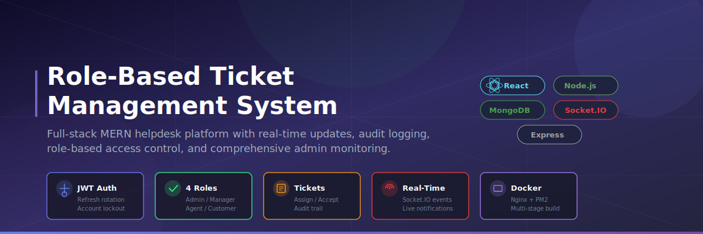

<div align="center">



[](#license)
[](https://nodejs.org)
[](https://react.dev)
[](https://www.mongodb.com)

</div>

---

## What It Does

A helpdesk-style ticketing platform where customers submit support requests and agents work through them. Admins and managers oversee the entire operation through a dedicated monitoring dashboard with real-time system health, agent performance metrics, and ticket trend analytics.

**Core workflow:** Customer creates ticket --> Admin/Manager assigns to Agent --> Agent accepts or rejects --> Agent works the ticket --> Ticket resolved/closed.

Every action is audit-logged. Every role has strict permission boundaries.

---

## Features

### Authentication & Security
- JWT-based login with HttpOnly refresh token rotation
- Account lockout after 5 failed login attempts
- Password policy enforcement (length, complexity, weak password rejection)
- Rate limiting on auth endpoints (5 req/15min) and general API (500 req/15min)
- Helmet security headers, CORS configuration, MongoDB injection sanitization
- Welcome email on registration, password reset via email (Nodemailer + Ethereal fallback)
- Admin-controllable registration toggle (can disable public signups)

### Role-Based Access Control
Four distinct roles with enforced permission boundaries:

| Role | What They Can Do |
|------|-----------------|
| **Admin** | Full system access -- manage users, assign tickets, view monitoring dashboard, configure system settings, toggle registration |
| **Manager** | Assign tickets to agents, monitor team performance, manage agents and customers |
| **Agent** | Accept/reject assigned tickets, update ticket status, communicate via comments, view unassigned open tickets |
| **Customer** | Create tickets, view own tickets, add comments, edit open tickets |

### Ticket Management
- Create, update, soft-delete tickets with priority levels (low/medium/high/urgent)
- Ticket categories: technical, billing, general, feature request, bug report, account, other
- Agent assignment workflow with accept/reject and full rejection history tracking
- Status pipeline: Open --> In Progress --> Resolved --> Closed
- Full audit trail on every ticket operation (auto-expires after 90 days via MongoDB TTL)
- Ticket metadata capture (browser, OS, device, IP address)

### Real-Time Updates
- Socket.IO for live ticket notifications
- Instant updates when tickets are assigned, status changes, or comments are added
- Typing indicators for comment composition
- User online/offline presence tracking

### Comments
- Add comments to tickets (internal/staff-only or external/customer-visible)
- 15-minute edit window for comment authors
- Comment notification emails

### Admin Monitoring Dashboard
- System health overview (uptime, memory, active connections)
- Active user tracking with online/offline presence
- Error feed from 5xx server errors persisted to database
- Agent performance metrics
- Ticket trend analytics
- System configuration (registration toggle, log level, max login attempts, session timeout, password policies)

### Email Service
- Welcome emails on registration
- Password reset emails with token
- Ticket assignment and status change notifications
- Comment notification emails
- Bulk email capability
- Ethereal test account fallback when no email credentials configured

### API Documentation
- Swagger/OpenAPI docs served at `/api-docs` (disabled in production)
- Versioned API routes (`/api/v1/`) with legacy redirect support

### Infrastructure
- Docker multi-stage builds with non-root user
- Docker Compose with separate dev/prod overrides
- Nginx reverse proxy with TLS 1.2/1.3, gzip, and security headers
- PM2 clustering with memory guard and exponential backoff restarts
- Pre-deploy environment validator (`check-env.js`)
- Graceful shutdown handlers (SIGTERM/SIGINT)
- Structured JSON logging (production) / colored text logging (development)
- HTTP request logging middleware
- Process-level error guards (uncaughtException, unhandledRejection)

---

## Tech Stack

| Layer | Technology |
|-------|-----------|
| Frontend | React 18, Vite, React Query, React Hook Form, Tailwind CSS, Socket.IO Client, Axios, React Router, Lucide Icons, Date-fns, DOMPurify |
| Backend | Node.js, Express, Mongoose, JWT, Socket.IO, Nodemailer, Joi |
| Database | MongoDB (Mongoose ODM) |
| Validation | Joi (server), react-hook-form (client) |
| Testing | Jest + Supertest (backend), Vitest (frontend) |
| Deployment | Docker, Nginx, PM2 |

---

## Quick Start

### Prerequisites
- Node.js v18+
- MongoDB (local instance or Atlas)
- npm or yarn

### Installation

```bash
# Clone the repository
git clone <repository-url>
cd Role-Based-Ticketing-System

# Install server dependencies
cd server
npm install

# Install client dependencies
cd ../client
npm install
```

### Environment Setup

```bash
# In server directory
cp .env.example .env
# Edit .env with your MongoDB URI and JWT secrets

# In client directory
cp .env.example .env
# Edit .env with your API URL
```

### Running Locally

```bash
# Terminal 1 -- Backend
cd server
npm run dev

# Terminal 2 -- Frontend
cd client
npm run dev
```

### Running with Docker

```bash
# Development
docker compose -f docker-compose.yml -f docker-compose.dev.yml up --build

# Production
docker compose -f docker-compose.yml -f docker-compose.prod.yml up --build
```

---

## Project Structure

```
server/
├── features/
│   ├── auth/           # Authentication, login, registration, password reset
│   ├── users/          # User CRUD, role management, agent listing
│   ├── tickets/        # Ticket CRUD, assignment, audit logs
│   ├── comments/       # Comment system with internal/external flags
│   └── monitoring/     # System health, performance, and config endpoints
├── shared/
│   ├── middleware/     # Auth, RBAC, rate limiting, error handling, validation
│   ├── services/       # Email service (Nodemailer + Ethereal fallback)
│   ├── utils/          # Logger, password validation
│   ├── config/         # Swagger, database connection, Socket.IO setup
│   ├── constants/      # Roles, permissions, ticket statuses, priorities, categories
│   ├── models/         # System config and error models
│   ├── routes/         # Route setup, system routes, legacy redirects
│   └── templates/      # Email HTML templates
├── scripts/            # promote-admin utility
├── __tests__/          # Jest + Supertest integration tests
├── pm2.config.cjs      # PM2 ecosystem configuration
└── server.js           # Application entry point

client/src/
├── features/
│   ├── auth/           # Login, Register, Forgot/Reset Password
│   ├── tickets/        # Ticket list, detail, create forms
│   ├── users/          # Admin user management
│   ├── comments/       # Comment service
│   ├── dashboard/      # Role-based dashboard views + monitoring
│   └── settings/       # Role-based settings (admin, manager, agent, customer)
├── shared/
│   ├── components/     # Layout, Navbar, Sidebar, ProtectedRoute, ErrorBoundary, alerts
│   ├── hooks/          # Custom React hooks
│   └── utils/          # Constants, token utils, password validation
├── pages/              # Landing page
├── App.jsx
└── main.jsx
```

---

## API Endpoints

All endpoints are prefixed with `/api/v1`.

### Authentication (Public)
- `POST /api/v1/auth/register` -- Register a new customer account
- `POST /api/v1/auth/login` -- Login and receive access + refresh tokens
- `POST /api/v1/auth/refresh` -- Refresh access token via HttpOnly cookie
- `POST /api/v1/auth/forgot-password` -- Request password reset email
- `POST /api/v1/auth/reset-password` -- Reset password with token

### Authentication (Protected)
- `GET /api/v1/auth/profile` -- Get current user profile
- `PUT /api/v1/auth/profile` -- Update profile
- `PUT /api/v1/auth/change-password` -- Change password
- `POST /api/v1/auth/logout` -- Invalidate refresh token

### Users (Admin/Manager)
- `GET /api/v1/users` -- List users with filtering and pagination
- `POST /api/v1/users` -- Create a new user
- `GET /api/v1/users/:id` -- Get user by ID
- `PUT /api/v1/users/:id` -- Update user
- `DELETE /api/v1/users/:id` -- Soft-delete (deactivate) user
- `GET /api/v1/users/stats` -- User statistics
- `GET /api/v1/users/agents` -- List active agents

### Tickets
- `GET /api/v1/tickets` -- List tickets (role-filtered with pagination)
- `POST /api/v1/tickets` -- Create a new ticket
- `GET /api/v1/tickets/:id` -- Get ticket by ID
- `PUT /api/v1/tickets/:id` -- Update ticket
- `DELETE /api/v1/tickets/:id` -- Soft-delete ticket
- `GET /api/v1/tickets/stats` -- Ticket statistics
- `PUT /api/v1/tickets/:id/assign` -- Assign ticket to agent (Admin/Manager)
- `PUT /api/v1/tickets/:id/accept` -- Accept ticket assignment (Agent)
- `PUT /api/v1/tickets/:id/reject` -- Reject ticket with reason (Agent)
- `GET /api/v1/tickets/:id/audit` -- View ticket audit log (Admin/Manager)

### Comments
- `GET /api/v1/comments/ticket/:ticketId` -- Get comments for a ticket
- `POST /api/v1/comments/ticket/:ticketId` -- Add comment to ticket
- `GET /api/v1/comments/:id` -- Get specific comment
- `PUT /api/v1/comments/:id` -- Update comment (author only, 15-min window)
- `DELETE /api/v1/comments/:id` -- Delete comment

### Monitoring (Admin)
- `GET /api/v1/monitoring/health` -- System health overview
- `GET /api/v1/monitoring/active-users` -- Active user tracking
- `GET /api/v1/monitoring/errors` -- Server error feed
- `PATCH /api/v1/monitoring/errors/:id/resolve` -- Mark error as resolved
- `GET /api/v1/monitoring/audit-log` -- Global audit log
- `GET /api/v1/monitoring/stats` -- System statistics
- `GET /api/v1/monitoring/agent-performance` -- Agent metrics (Admin/Manager)
- `GET /api/v1/monitoring/config` -- Get system configuration
- `PUT /api/v1/monitoring/config` -- Update system configuration

### System
- `GET /health` -- Health check endpoint
- `GET /api/version` -- API version information

---

## Security Features

- **JWT + HttpOnly refresh cookies** -- Access tokens in memory only, refresh tokens in Secure SameSite=Strict cookies
- **Refresh token rotation** -- Stolen token reuse detection invalidates all sessions
- **Account lockout** -- 5 failed attempts triggers 15-minute lockout
- **Rate limiting** -- Auth: 5 req/15min, General: 500 req/15min
- **Input validation** -- Joi schemas on every endpoint with `stripUnknown: true`
- **XSS protection** -- Server-side `xss` library, client-side DOMPurify
- **MongoDB injection prevention** -- `express-mongo-sanitize`
- **Security headers** -- Helmet with CSP, HSTS (1 year + preload), X-Frame-Options
- **Password hashing** -- bcrypt with configurable rounds
- **Stack traces** -- Only exposed in development mode
- **Audit logging** -- Every ticket operation persisted with actor, changes, and timestamp (auto-expires after 90 days)
- **Graceful shutdown** -- SIGTERM/SIGINT handlers with 30-second timeout
- **Process error guards** -- uncaughtException and unhandledRejection handlers

---

## Testing

```bash
# Backend tests
cd server
npm test

# Frontend tests
cd client
npm test
```

Backend tests cover authentication flows (registration, login, refresh, password reset) and role-based access control across all four roles using Jest + Supertest. Frontend uses Vitest.

---

## Deployment

### Docker (Recommended)

```bash
# Production build
docker compose -f docker-compose.yml -f docker-compose.prod.yml up --build -d
```

The production stack includes:
- Nginx reverse proxy with TLS termination
- PM2 process manager with clustering
- MongoDB (or external Atlas connection)
- Pre-deploy environment validation

### Manual

1. Set production environment variables (see `.env.production.example` at project root)
2. Run `node scripts/check-env.js` to validate configuration
3. Start server with PM2: `pm2 start pm2.config.cjs`
4. Build client: `cd client && npm run build`
5. Serve client build through Nginx or your hosting platform

---

## Environment Variables

### Server (.env)

```
NODE_ENV=development
PORT=5000
MONGODB_URI=mongodb://localhost:27017/ticket-system
JWT_SECRET=your-jwt-secret-here
JWT_REFRESH_SECRET=your-refresh-secret-here
CLIENT_URL=http://localhost:5173
EMAIL_USER=
EMAIL_PASSWORD=
```

See `.env.production.example` at the project root for the full list with descriptions.

### Client (.env)

```
VITE_API_URL=http://localhost:5000/api/v1
VITE_SOCKET_URL=http://localhost:5000
```

---

## License

MIT
